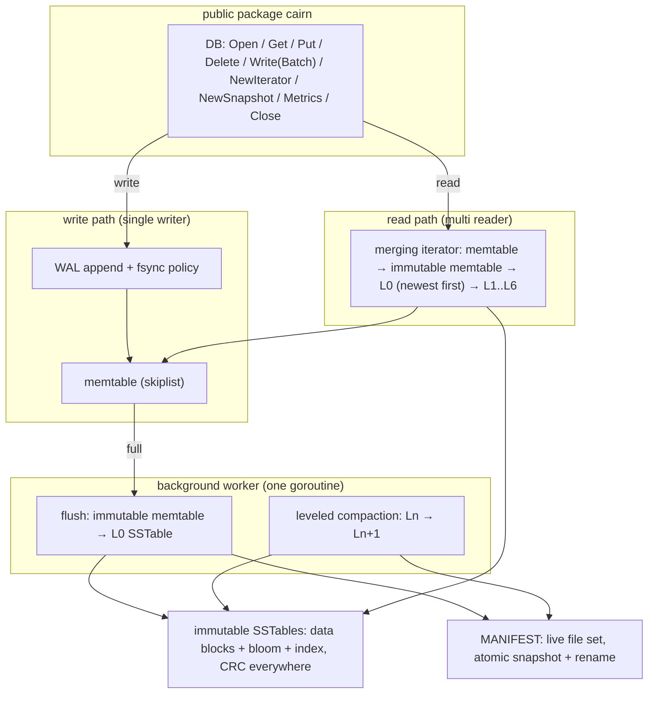

# Cairn Design Document

**Status:** Implemented — this document describes the shipped v1 design. Approved as the
build contract before the first line of code; updated after implementation only where the
shipped API refined the draft (noted inline).
**Scope:** v1 (`v0.1.0`)
**Module:** `github.com/devosher01/cairn`
**Language:** Go (latest stable, pinned in CI). Zero third-party dependencies in the engine.

---

## 1. Overview

Cairn is an embedded, persistent, ordered key-value storage engine for Go, built on a
log-structured merge-tree (LSM). It runs inside a single process, serializes writes
internally, and supports many concurrent readers with consistent MVCC snapshots.

### 1.1 Goals

- **Crash correctness, proven mechanically.** Every durability claim is verified by a
  deterministic simulation harness that enumerates the crash space. Green CI is the
  definition of truth; no human testing.
- **Predictable behavior.** Precise durability contracts per sync mode, bounded write
  stalls, documented amplification.
- **Readable architecture.** Every component has one reason to exist. The simplest
  design that meets the guarantees wins.

### 1.2 Non-goals (v1)

Networking, replication, SQL, multi-key transactions beyond the atomic batch, block
compression, block cache, custom comparators, TTLs, column families. None of the v1
design speculates about these.

### 1.3 Guarantees

- `Put`/`Delete`/`Batch` are atomic and totally ordered by sequence number.
- Snapshots and iterators observe an immutable, consistent point-in-time view.
- After any crash, recovery yields a state equal to a **prefix** of the acknowledged
  operation history: no holes, no reordering, no partially applied batches, no
  corruption. Under `SyncAlways`, the prefix includes every acknowledged write.
- Iteration is in ascending bytewise key order.

---

## 2. Architecture



### 2.1 Package layout

```
cairn/                    public API + engine core (DB, write/read paths,
                          flush/compaction orchestration, versions, recovery)
  internal/env            FS, Clock, Rand interfaces; osenv (real) and simenv
                          (deterministic simulation with fault injection)
  internal/keys           internal key encoding, comparator, sequence numbers
  internal/batch          batch encoding (shared by WAL payload and memtable apply)
  internal/wal            WAL writer, reader/replayer, record framing
  internal/memtable       skiplist
  internal/sstable        block builder/reader, table writer/reader, bloom filter
  internal/manifest       manifest encode/decode, atomic install
```

**Import DAG:** the root package imports `internal/*`; internal packages import only
`internal/env` and `internal/keys` (plus stdlib); `internal/env` and `internal/keys`
import only stdlib. No cycles, no internal package imports the root.

**Responsibility rationale (one reason each):**

| Package | Single responsibility |
|---|---|
| `env` | Boundary to the outside world (disk, time, randomness). Exists so tests can replace the world with a deterministic simulation. |
| `keys` | One place defining ordering and MVCC encoding. Every other component depends on this being consistent. |
| `batch` | One encoding for atomic write units, reused verbatim as the WAL payload — recovery replays exactly what was committed. |
| `wal` | Durability of recent writes. Knows framing and fsync; knows nothing about keys or tables. |
| `memtable` | Fast ordered in-memory view of recent writes. |
| `sstable` | Immutable on-disk sorted runs. Knows its own format; knows nothing about levels. |
| `manifest` | Atomic transitions of the persistent file-set state. |
| root `cairn` | Composition: orchestrates the above into an LSM; owns concurrency and lifecycle. |

---

## 3. Data model

- **User keys:** `[]byte`, 1..65536 bytes, ordered by `bytes.Compare`.
- **User values:** `[]byte`, 0..4 MiB. `nil` and empty are equivalent.
- **Sequence numbers:** `uint64`, strictly monotonic, assigned at commit. Each entry
  in a batch consumes one. Stored in 56 bits (see trailer); 2^56 operations is
  unreachable in practice. Sequence 0 is reserved as invalid.
- **Kinds:** `SET = 1`, `DELETE = 2`. Deletes are tombstones until compaction can
  prove no older version survives below (§9.4).

### 3.1 Internal key

```
internal_key = user_key ‖ trailer
trailer      = uint64( seq << 8 | kind )      8 bytes, little-endian
```

**Comparator:** ascending `bytes.Compare` on `user_key`; ties broken by *descending*
trailer, so the newest version of a key sorts first. Two entries can never share
`(user_key, seq)` because every operation consumes a unique sequence number.

**MVCC visibility:** a read at snapshot `S` returns, for each user key, the first
entry with `seq ≤ S` in comparator order; if that entry is a tombstone the key is
absent. The comparator makes this a single "seek to `(key, S)`" per source.

---

## 4. On-disk formats

Conventions for every file: **little-endian** fixed-width integers; unsigned LEB128
(`binary.Uvarint`) where marked `uvarint`; CRC32-C (Castagnoli, `hash/crc32`) for all
checksums. CRCs are not masked: no checksummed region ever embeds another CRC of
itself, so LevelDB-style masking solves a problem cairn does not have.

### 4.1 Directory layout

```
<dir>/
  LOCK              exclusive advisory lock (flock); empty file
  MANIFEST          current persistent state (single full snapshot)
  MANIFEST.tmp      transient; only during a manifest install
  NNNNNN.wal        write-ahead logs
  NNNNNN.sst        SSTables
```

`NNNNNN` is a 6-digit zero-padded number from a single shared counter
(`next_file_num`). File numbers never repeat within a database's life.

### 4.2 WAL format

```
file   := header record*
header := magic[8]="CAIRNWAL" version:u32(=1)                       12 bytes
record := crc:u32 length:u32 payload[length]
```

- `crc` covers `length ‖ payload`.
- `payload` is exactly one encoded batch (§4.3). Max encoded size 64 MiB.
- **Replay rule:** read records sequentially; stop at EOF, at a `length` that is
  implausible (exceeds remaining file or 64 MiB), or at a CRC mismatch. Everything
  before the stop point is applied; everything after is logically discarded. A torn
  tail write is therefore truncated, which is precisely the prefix guarantee.
  Corruption of *previously fsynced* records is indistinguishable from a torn tail
  by design; the crash model assumes the disk does not corrupt fsynced data
  (bit-rot detection is a checksum failure surfaced as `ErrCorruption` on later
  reads, not silently accepted).
- **Rotation:** when the memtable rotates, the outgoing WAL is fsynced and closed
  regardless of sync mode. This makes the cross-file durable state always a prefix
  of history in every mode.

### 4.3 Batch encoding (WAL payload = memtable apply unit)

```
batch := seq_base:u64 count:u32 entry{count}
entry := kind:u8 klen:uvarint key[klen] ( vlen:uvarint value[vlen] )   value only if kind=SET
```

Entry `i` commits at `seq_base + i`. Limits validated at the API boundary:
`count ≤ 1_000_000`, encoded size ≤ 64 MiB.

### 4.4 SSTable format

```
file := data_block* filter_block index_block footer

block         := payload trailer
trailer       := type:u8(=0 raw) crc:u32          crc covers payload ‖ type
data_payload  := data_entry*
data_entry    := klen:uvarint vlen:uvarint internal_key[klen] value[vlen]
filter_payload:= k:u8 bits[⌈n·bits_per_key / 8⌉]
index_payload := index_entry*
index_entry   := klen:uvarint vlen:uvarint internal_key[klen] handle[vlen]
handle        := offset:uvarint length:uvarint    length includes the 5-byte trailer

footer (48 bytes, fixed):
  [ 0..8)   index_offset:u64
  [ 8..16)  index_length:u64
  [16..24)  filter_offset:u64
  [24..32)  filter_length:u64
  [32..36)  format_version:u32 (=1)
  [36..40)  crc:u32 over footer bytes [0..36)
  [40..48)  magic[8]="CAIRNSST"
```

- **Data blocks:** entries in comparator order; a block is cut at the first entry
  boundary at or beyond `BlockSize` (default 4 KiB). No prefix compression and no
  restart points in v1: lookup within a block is a linear scan of ≤ ~4 KiB, which
  is nanoseconds-scale and removes an entire class of encoding bugs. Deliberate
  trade documented in §18.
- **Index block:** one entry per data block; the key is the block's last internal
  key verbatim (no separator shortening in v1), the value is the block handle. The
  index is parsed into memory when the table is opened.
- **Filter block:** one bloom filter over all *user* keys in the table.
  `bits_per_key = 10` default, `k = max(1, min(30, round(bits_per_key · ln 2)))`.
  Hash: in-house MurmurHash3 x64-128 (public-domain algorithm), first 8 bytes as
  `h`; probe `i` sets bit `(lo32(h) + i·hi32(h)) mod m`. Fixed test vectors guard
  the implementation. Duplicate user keys (multiple versions) hash identically and
  cost nothing extra.
- Tables are never empty: a flush of an empty memtable is skipped and a compaction
  that produces zero entries installs no output file.
- Table metadata (smallest/largest internal key, size, entry count) lives in the
  manifest, not in the table.

### 4.5 MANIFEST format

```
manifest := magic[8]="CAIRNMAN" version:u32(=1)
            next_file_num:u64 last_seq:u64 oldest_wal:u64
            level_count:u8(=7) level{7}
            crc:u32 over all preceding bytes
level    := table_count:u32 table{table_count}
table    := file_num:u64 size:u64 entry_count:u64
            smallest_len:uvarint smallest[..] largest_len:uvarint largest[..]
```

`smallest`/`largest` are internal keys. `oldest_wal` is the lowest live WAL file
number: recovery replays every `*.wal` with number ≥ `oldest_wal`, in ascending
order, including WALs created after this manifest was written.

**Atomic install:** write `MANIFEST.tmp` → fsync file → rename onto `MANIFEST` →
fsync directory. The manifest is a full snapshot, rewritten on every flush and
compaction. Rationale: installs happen at flush/compaction frequency (seconds, not
microseconds) over a file of a few KiB, so a snapshot-plus-rename buys LevelDB-level
atomicity without a manifest log, version edits, replay, or a `CURRENT` pointer.

**File GC ordering invariant:** no file is ever deleted until a manifest that no
longer references it has been renamed *and* the directory fsynced. New SSTables are
fsynced before the manifest that references them is installed. Files present on disk
but absent from the manifest are orphans and are deleted during recovery.

### 4.6 LOCK

Empty file, `flock(LOCK_EX | LOCK_NB)` held for the life of the handle. A second
`Open` on the same directory fails with `ErrLocked`. The sim env implements the same
semantics in memory.

---

## 5. Write path

```
Write(batch):
  1. validate batch at the boundary (key/value/batch limits)      → ErrInvalidKey / ErrInvalidValue / ErrBatchTooLarge
  2. acquire commitMu                                             (serializes writers; WAL order = seq order)
  3. if L0 table count ≥ L0StallTrigger: wait on stall cond       (released by compaction)
  4. assign seq_base = lastSeq + 1; lastSeq += count
  5. encode batch; append record to active WAL
  6. fsync per sync mode (SyncAlways: now; others: deferred)
  7. apply batch to memtable (no WAL involvement)
  8. publish visibleSeq = seq_base + count - 1 (atomic release store)
  9. if memtable ≥ MemtableSize: rotate (§8)
 10. release commitMu; return
```

Readers snapshot `visibleSeq` with an acquire load, so a batch becomes visible
atomically at step 8 — a concurrent reader either sees all of it or none.

### 5.1 Durability contracts

| Mode | Contract on `Write` return |
|---|---|
| `SyncAlways` (default) | Entry is durable. A crash loses nothing acknowledged. |
| `SyncInterval` | Entry is durable within ≤ `Options.Interval` (background timer fsync via `Clock`). A crash loses at most the last window. |
| `SyncOff` | Durable only at WAL rotation and `Close`. A crash may lose the entire unsynced suffix. |

All modes preserve the **prefix property** (§1.3). WAL rotation and `Close` fsync
unconditionally, so the durable frontier never interleaves across files.

### 5.2 Backpressure

One hard threshold: if L0 has ≥ `L0StallTrigger` (default 12) tables, writers block
until compaction brings it below. No slowdown tier in v1 — a single, easily testable
mechanism; graduated throttling is future work. Stall count and total stall time are
metrics.

---

## 6. Read path

`Get(key)` at snapshot `S` (implicit `S = visibleSeq` for `DB.Get`):

1. Briefly take `mu`, reference the current *read state*: memtable, immutable
   memtable (if any), and the current version (table set). Release `mu`. All
   subsequent work is lock-free against writers.
2. Seek `(key, S)` in: memtable → immutable memtable → each L0 table newest-first →
   for each of L1..L6, the single table whose range covers `key` (binary search over
   the level's sorted, disjoint tables).
3. For SSTables: bloom check first (on user key); on maybe, binary-search the
   in-memory block index, read one block, verify CRC, linear-scan the block.
4. First hit wins: `SET` returns the value (copied), `DELETE` returns `ErrNotFound`.

There is no block cache in v1; cairn relies on the OS page cache. Rationale in §18.

Iterators (§10 in API terms) are a heap-based k-way merge over the same sources,
bounded by `[LowerBound, UpperBound)`, filtered by snapshot visibility: for each user
key, only the newest entry with `seq ≤ S` is considered, tombstones are skipped.
`Key()`/`Value()` are valid until the next positioning call (zero-copy); an iterator
is not safe for concurrent use by multiple goroutines.

---

## 7. Memtable

A skiplist over internal keys (comparator from §3.1), max height 12, branching
p = 1/4, height drawn from the injected `Rand` — memtable shape is a pure function
of the seed, which crash and model tests rely on.

Concurrency: exactly one writer at a time (guaranteed by `commitMu`), wait-free
concurrent readers. Inserts link nodes bottom-up with atomic pointer stores; readers
traverse with atomic loads. Publishing a node's lowest-level link is the
happens-before edge that makes it visible. Replay idempotence: inserting an internal
key that already exists is a no-op (same seq ⇒ same payload by construction).

No arena allocator in v1 — plain Go allocation until phase-7 benchmarks prove the GC
pressure matters (§18).

The memtable and immutable memtable are reference-counted: a flush may complete and
install its SSTable while an old iterator still reads the immutable memtable; memory
is released when the last reference drops.

---

## 8. Flush

Rotation (write path, step 9): the active memtable becomes *immutable*, a new WAL
(next file number) is created and the old one fsynced and closed, a fresh memtable
becomes active, and the background worker is signaled. There is exactly one immutable
memtable slot: if it is still occupied when the next rotation is needed, the writer
waits (this is the memtable-flush backstop behind the L0 stall).

Flush task (background worker):

1. Write one SSTable from the immutable memtable in comparator order; fsync it.
2. Install a new manifest: table added to L0, `oldest_wal` advanced past every WAL
   whose entire content is now flushed.
3. Fsync directory; delete obsolete WALs; drop the immutable memtable reference.

L0 tables may overlap each other; they are ordered by file number (creation order),
and reads consult them newest-first.

---

## 9. Compaction

### 9.1 Shape

Leveled, seven levels (L0..L6). Level targets: L1 = `BaseLevelSize` (default 10 MiB),
each next level ×10. Output tables are cut at `TargetFileSize` (default 4 MiB).
L1..L6 each hold sorted, pairwise-disjoint tables — the core structural invariant.

### 9.2 Triggering

One background worker owns all flushes and compactions, one task at a time (flushes
take priority). After every install it recomputes scores:

```
score(L0) = table_count / L0CompactTrigger          (default trigger 4)
score(Ln) = level_bytes / target_bytes(n)            n ≥ 1
```

The highest score ≥ 1.0 is compacted. L0 compaction takes *all* L0 tables plus every
overlapping L1 table. Ln→Ln+1 (n ≥ 1) picks the next table after a per-level cursor
(round-robin over the keyspace, wraps) plus all overlapping Ln+1 tables.

### 9.3 Execution

A compaction merges its inputs with the same k-way merge as reads, writes new tables
(fsync each), then installs one manifest transition: inputs out, outputs in, in one
atomic snapshot. Crash at any point leaves either the old state (outputs become
orphans, deleted on recovery) or the new state — never a mix.

### 9.4 Garbage collection of versions and tombstones

For each user key within a compaction, walking newest→oldest:

- An older version may be dropped if a newer version of the same key exists in the
  compaction *and* both are ≤ the oldest live snapshot seq (i.e. no snapshot can
  distinguish them). With no live snapshots that means: keep newest, drop the rest.
- A tombstone may additionally be dropped (not just kept-newest) only when the
  compaction's output level is the bottommost level whose key range can contain that
  key — no table in any deeper level overlaps it — and its seq is ≤ the oldest live
  snapshot. Otherwise it must survive to keep shadowing older versions below.

### 9.5 Obsolete file deletion

Versions (table sets) are reference-counted; every file's liveness is the union of
live versions referencing it. Files replaced by an installed manifest are queued and
physically deleted when their reference count reaches zero (snapshots/iterators pin
versions). Clean close deletes nothing early and leaks nothing (invariant I8, §17.5).

---

## 10. Recovery

### 10.1 State machine

```mermaid
stateDiagram-v2
    [*] --> Locked : flock(LOCK)
    Locked --> Fresh : no MANIFEST, no data files
    Fresh --> ManifestLoaded : write initial MANIFEST (tmp→rename→syncdir)
    Locked --> ManifestLoaded : read MANIFEST, verify magic/version/CRC
    ManifestLoaded --> DirReconciled : verify referenced files (exist, size match);\ndelete orphans (.tmp, unreferenced .sst, .wal < oldest_wal)
    DirReconciled --> WALReplayed : replay each .wal ≥ oldest_wal ascending;\nstop each at torn/invalid tail
    WALReplayed --> Open : lastSeq = max(manifest, replayed);\nnextFileNum = max(manifest, seen)+1;\ncreate fresh WAL; start worker
    Locked --> Failed : ErrLocked
    ManifestLoaded --> Failed : ErrCorruption (bad manifest, missing/short table file)
    Open --> [*]
```



Notes:

- A missing manifest with data files present is `ErrCorruption`: the initial
  manifest is durably installed before the first WAL is ever created, so this state
  cannot arise from a crash — only from external damage. Cairn refuses to guess.
- Replay applies batches through the normal apply path minus WAL append; memtable
  overflow during replay triggers ordinary flushes. `oldest_wal` advances at file
  granularity, so a crash mid-recovery re-replays some records — idempotent by §7.
- Torn WAL tails are truncated logically (replay stops), never rewritten; old WALs
  are immutable after recovery and die when flushed.
- Opening a fresh WAL needs no manifest write: any WAL number ≥ `oldest_wal` is
  replayed by definition.

### 10.2 Crash analysis by boundary

| Crash point | Recovered state |
|---|---|
| Mid WAL record write | Record fails CRC → truncated → prefix ends at previous record. |
| After WAL fsync, before ack | Entry durable but unacknowledged — recovery *may* include it; allowed, it is a valid longer prefix. |
| Mid SSTable write (flush/compaction) | Table not in any manifest → orphan → deleted. Old state intact. |
| After `MANIFEST.tmp` write, before rename | Tmp deleted on recovery. Old state intact. |
| After rename, before dir fsync | Rename may or may not be durable → old or new manifest, both self-consistent; inputs not yet deleted (GC ordering invariant §4.5). |
| After dir fsync, before obsolete deletion | New state; stale files are orphans → deleted. |
| Mid recovery itself | Recovery is read-only except orphan deletion and initial-manifest install, both idempotent. |

---

## 11. Concurrency model

**Threads:** user goroutines (any number), one background worker, plus the interval
fsync timer goroutine when `SyncInterval` is active.

**Locks and atomics:**

| Primitive | Protects |
|---|---|
| `commitMu` (mutex) | Whole write path: seq assignment, WAL append, memtable apply, rotation. Guarantees WAL order = seq order. |
| `mu` (mutex) | Engine state: memtable/immutable pointers, version set, snapshot list, refcounts, closed flag. Held only briefly — never during I/O. |
| `visibleSeq` (atomic u64) | Read visibility frontier. Release store on commit, acquire load on read. |
| stall `sync.Cond` on `mu` | L0 stall and immutable-memtable wait. |

**Lock order:** `commitMu` → `mu`. The background worker takes only `mu` (never
`commitMu`), so the stall cycle writer-waits-for-worker cannot deadlock.

**Reads never block writes:** readers hold `mu` only to grab references; iteration
and Get I/O run against immutable structures (skiplist nodes, closed memtables,
immutable tables pinned by version refcounts).

**Snapshots:** `seq` + pinned version + pinned memtables. The minimum live snapshot
seq (tracked in an ordered set under `mu`) feeds compaction GC (§9.4).

**Close:** under `mu` set closed, then: signal and join the worker, fsync and close
the WAL, release the lock file. Close does **not** flush the memtable — the WAL
already makes it durable, and replay restores it on next open; this keeps `Close`
O(sync) instead of O(memtable). `Close` returns `ErrOpenHandles` if iterators or
snapshots are still open — explicit over undefined behavior. All API calls after
close return `ErrClosed`.

---

## 12. Environment abstraction

Everything nondeterministic enters through one injected `Env`:

```go
type Env struct {
    FS    FS
    Clock Clock
    Rand  Rand
}

type FS interface {
    Create(name string) (File, error)
    Open(name string) (File, error)
    Remove(name string) error
    Rename(oldname, newname string) error
    List() ([]string, error)
    SyncDir() error
    Lock() (io.Closer, error)
}

type File interface {
    io.ReaderAt
    io.Writer
    Sync() error
    Close() error
    Size() (int64, error)
}

type Clock interface {
    Now() time.Time
    NewTicker(d time.Duration) Ticker
}

type Rand interface {
    Uint64() uint64
}
```

`osenv` is the thin real implementation (`os.File`, `flock`, real time,
`crypto/rand`-seeded PCG). `simenv` is the deterministic simulator. The engine never
touches `os`, `time.Now`, or global rand directly — enforced by a lint check in CI
(forbidden-import test).

### 12.1 Simulated filesystem fault model

`simenv` keeps, per file, a **durable image** and a **volatile op journal**, plus a
volatile directory-entry journal (creates/renames/removes are volatile until
`SyncDir`). Every mutating call appends to a global **op log**. `Sync` promotes a
file's volatile writes to durable; `SyncDir` promotes directory operations.

A **crash at op-log index i** materializes a post-crash disk:

- Ops after `i` never happened.
- Every synced state is intact.
- Unsynced file writes survive per a seeded **crash mode**:
  - `none` — all unsynced writes lost.
  - `prefix` — the unsynced write sequence survives up to a cut point, with the cut
    write torn at an enumerated byte boundary.
  - `scatter` — a seeded arbitrary subset of unsynced 512-byte sectors survives
    (models out-of-order writeback; holes must be caught by CRCs).
- Unsynced directory ops may independently survive or vanish (models rename-before-
  dir-fsync).

Fault injection beyond crashes, all seed-driven: `Sync`/`Write` returning `EIO`,
`ENOSPC` at a chosen byte budget, `Rename` failure. Injected errors are recorded so
tests can assert the engine's response.

### 12.2 Failure policy

- WAL append/fsync error or manifest install error → the DB enters a **sticky failed
  state**: every subsequent write returns the original error wrapped in
  `ErrDBFailed`; reads may continue. Rationale: after a failed fsync the durable
  frontier is unknowable (fsyncgate); pretending otherwise corrupts.
- Flush/compaction I/O errors → task aborted, partial outputs deleted, retried with
  backoff (they are reconstructible; nothing was acknowledged against them).
- Checksum mismatch on any read → `ErrCorruption` with file and offset context.
- Internal invariant violations panic: they are bugs, not conditions to handle.
  Boundary validation happens once, at the public API.

---

## 13. Public API

```go
func Open(dir string, opts *Options) (*DB, error)

func (db *DB) Get(key []byte) ([]byte, error)          // ErrNotFound; returned slice is a copy
func (db *DB) Put(key, value []byte) error
func (db *DB) Delete(key []byte) error
func (db *DB) Write(b *Batch) error                    // atomic
func (db *DB) NewIterator(o IterOptions) (*Iterator, error)
func (db *DB) NewSnapshot() (*Snapshot, error)
func (db *DB) Metrics() Metrics
func (db *DB) Close() error

type Batch struct{ ... }                               // NewBatch(); (*Batch).Put / Delete / Reset / Count / Len

type Snapshot struct{ ... }                            // Get / NewIterator / Close

type Iterator struct{ ... }                            // SeekGE / First / Next (each returns bool)
                                                       // Valid / Key / Value / Error / Close

type IterOptions struct {
    LowerBound []byte                                  // inclusive; nil = unbounded
    UpperBound []byte                                  // exclusive; nil = unbounded
}
```

Shipped refinement over the draft: `NewSnapshot` and `NewIterator` return an error so a
closed database surfaces `ErrClosed` instead of a dead handle, and the iterator's
positioning methods return whether the iterator is valid.

`DB` is safe for concurrent use. Writes are serialized internally (single-writer
engine); readers scale. `Iterator` and `Batch` instances are single-goroutine.

**Errors:** `ErrNotFound`, `ErrClosed`, `ErrLocked`, `ErrCorruption`, `ErrDBFailed`,
`ErrOpenHandles`, `ErrInvalidKey`, `ErrInvalidValue`, `ErrBatchTooLarge`. All
wrapped with context, matchable via `errors.Is`.

---

## 14. Options and defaults

| Option | Default | Notes |
|---|---|---|
| `Env` | `osenv` | Tests inject `simenv`. |
| `Sync` | `SyncAlways` | Durability by default; opting into speed is explicit. |
| `Interval` | 100ms | Used when `Sync = SyncInterval`. |
| `MemtableSize` | 4 MiB | Rotation threshold. |
| `BlockSize` | 4 KiB | Data block cut target. |
| `BloomBitsPerKey` | 10 | ~1% false-positive rate. |
| `L0CompactTrigger` | 4 | Score 1.0 at 4 L0 tables. |
| `L0StallTrigger` | 12 | Hard write stall. |
| `BaseLevelSize` | 10 MiB | L1 target; ×10 per level below. |
| `TargetFileSize` | 4 MiB | Compaction output cut. |
| `DisableAutoCompaction` | false | Test hook: background worker idles; tests drive flush/compaction synchronously. |

Fixed in v1 (not options): comparator (bytewise), levels (7), CRC algorithm,
key/value/batch limits.

---

## 15. Metrics

`db.Metrics()` returns a consistent snapshot of atomic counters:

```go
type Metrics struct {
    Puts, Deletes, Batches, Gets   uint64
    WALBytesWritten, WALSyncs      uint64
    Flushes, FlushBytes            uint64
    Compactions                    uint64
    CompactionBytesRead            uint64
    CompactionBytesWritten         uint64
    BlockReads, BlockBytesRead     uint64
    BloomChecks, BloomNegatives    uint64
    GetTablesConsulted             uint64   // read amplification = / Gets
    WriteStalls                    uint64
    WriteStallDuration             time.Duration
    Levels                         [7]LevelMetrics // Tables, Bytes
}
```

Write amplification is derived, not stored:
`(WALBytesWritten + FlushBytes + CompactionBytesWritten) / user bytes written`.
Documented formulas ship with the type.

---

## 16. Performance budget

**Targets, not claims.** Nothing below appears in the README; the README publishes
only phase-7 measurements from reproducible commands on a declared machine (Apple
Silicon Mac, exact model stated). These targets exist to define "good enough" and to
catch regressions during development.

| Operation (single goroutine, 16 B keys / 100 B values) | Target |
|---|---|
| `Put`, `SyncOff` | ≥ 400k ops/s sustained |
| `Put`, `SyncAlways` | fsync-bound; measure and report only |
| `Get`, memtable-resident | p50 < 1 µs |
| `Get`, uniform over 10 M keys, page-cached | p50 < 10 µs |
| Iterator `Next`, sequential | ≥ 5 M entries/s |
| WAL replay | ≥ 100 MB/s |
| Write amplification, 10 GiB load, steady state | < 12 |
| Space amplification, steady state | < 1.4 |

Benchmarks compare against BoltDB and Pebble under identical workloads (phase 7).

---

## 17. Deterministic testing strategy

The definition of done for every phase is mechanical. Layers, from cheapest to
deepest:

### 17.1 Unit and golden tests

Per-package unit tests, plus **golden format tests**: fixed inputs produce
byte-exact WAL, SSTable, and MANIFEST files committed under `testdata/`. Any format
drift fails loudly and forces a deliberate `format_version` decision. The bloom hash
ships with fixed test vectors.

### 17.2 Model-based testing against an oracle

A seeded generator produces operation sequences over a small key domain:

```
Put | Delete | Batch | Get | Scan(lo,hi) | NewSnapshot | SnapshotGet | SnapshotScan
   | CloseSnapshot | Flush | Compact(level) | Reopen | CrashAndRecover
```

Each sequence runs against cairn-on-`simenv` and a trivial oracle (ordered map;
snapshots are cheap map copies; an acked-history log). Every read result is compared
on the spot; at sequence end a full iterator walk is compared against the oracle
dump. Divergence fails with the seed. `DisableAutoCompaction` plus explicit
`Flush`/`Compact` ops make scheduling part of the generated sequence — fully
deterministic. A failing sequence is auto-minimized by delta-debugging over the op
list before reporting.

CI runs thousands of sequences from a fixed seed corpus; nightly adds a
date-derived seed (logged, so any failure is replayable).

### 17.3 Crash-space enumeration

For each seeded workload: run it once on `simenv` recording the op log (N mutating
ops). Then for **every** index i in 1..N, materialize the post-crash disk per §12.1,
recover, and assert:

1. Recovery succeeds (no `ErrCorruption`, no panic).
2. The recovered state equals a prefix of the oracle's acked history; under
   `SyncAlways` the prefix includes every acked op (exact durability contract per
   mode).
3. All structural invariants hold (§17.5).

Torn-write variants: the cut write is torn at every byte boundary for WAL-record
writes, at every 512-byte boundary for larger writes. `scatter` mode runs S seeded
subsets per crash point. This is complete coverage of the crash space at op
granularity — the campaign size is `Σ ops × torn variants`, budgeted per CI tier
(§17.8). The v1 release gate is the full campaign: ≥ 1 M operations across
workloads, zero violations.

### 17.4 Fuzzing (native Go)

- `FuzzWALReplay` — arbitrary bytes as a WAL file: replay must terminate without
  panic and yield a valid prefix.
- `FuzzSSTableReader` — arbitrary bytes as a table: open/iterate must return
  `ErrCorruption` or valid data, never panic.
- `FuzzManifestDecode`, `FuzzBatchDecode` — same contract.
- `FuzzOps` — fuzz-generated op sequences into the §17.2 harness.

Corpora committed; CI runs short fuzz budgets, nightly runs longer.

### 17.5 Structural invariants

Checked after every flush, compaction, and recovery in all test harnesses:

- **I1** Every manifest-referenced file exists with the recorded size.
- **I2** L1..L6: tables sorted by smallest key, ranges pairwise disjoint.
- **I3** Within every table: internal keys strictly ascending.
- **I4** Every block CRC and the footer CRC verify.
- **I5** Bloom filters have no false negatives over the table's actual keys.
- **I6** No entry's seq exceeds `last_seq`.
- **I7** `next_file_num` exceeds every file number on disk.
- **I8** No live-version file deleted; no orphan survives recovery or clean close.

### 17.6 Concurrency and race

All tests run under `-race` in CI, always. A dedicated stress test runs concurrent
readers, one writer, snapshots, and iterators against the real background worker on
`simenv` — hunting races and torn visibility, not determinism.

### 17.7 Real-process kill -9

A harness binary writes with `SyncAlways` to a real filesystem, streaming each acked
key to the parent over a pipe; the parent SIGKILLs it at random times, reopens the
database, and verifies every acked key is present and all invariants hold.
Non-deterministic by design — a reality check on `osenv` and actual fsync behavior,
complementing (never replacing) the simulation. Runs in CI with a bounded iteration
count; nightly runs longer.

### 17.8 CI definition

GitHub Actions, matrix `{ubuntu-latest, macos-latest}` — green CI is the only
definition of truth:

| Job | Content | Budget |
|---|---|---|
| lint | `gofumpt` (diff-clean), `go vet`, `staticcheck`, `lawcheck` (zero comments, forbidden imports, no real-clock access) | fast |
| test | `go test -race ./...` including bounded model and crash campaigns, both OSes | ~2 min |
| fuzz | five fuzz targets, 20s each | ~3 min |
| kill9 | §17.7, 8 iterations, both OSes | ~1 min |
| bench-build | vet + short-test of the bench module | ~2 min |
| nightly | model campaign at scale 40 (1.68 M operations per OS, plus a run-id-derived extra seed), crash enumeration at scale 8 (~216 k crash states per OS), 10-minute fuzz per target, 150 kill -9 iterations per OS | ~1 h, scheduled + manual dispatch |

Reproducibility rules: every randomized test prints its seed on failure; no test
reads wall-clock time or global rand; the engine cannot (§12, enforced by lint).

---

## 18. Design decisions and alternatives

| Decision | Alternative | Why this way |
|---|---|---|
| LSM, leveled compaction | B-tree (Bolt); tiered/universal compaction | Write-optimized target; leveled gives bounded space amp and at most one table per level per read — the read-amp story stays explainable. Tiered trades that for write amp cairn doesn't need at embedded scale. |
| Skiplist memtable | B-tree / hash | Ordered iteration required; skiplist gives lock-free readers with a single writer for ~100 lines; deterministic under injected Rand. |
| Full-snapshot MANIFEST + rename | LevelDB manifest log + version edits + CURRENT | Installs are rare and small; a snapshot removes edit replay, log compaction, and the CURRENT pointer — three crash surfaces — for negligible I/O cost at v1 scale. |
| No prefix compression / restarts in blocks | LevelDB restart arrays | Linear scan of a 4 KiB block is nanoseconds; the encoding is ~5× simpler and golden tests stay human-readable. Revisit with benchmarks (future work). |
| No block cache | LRU cache | OS page cache already caches these exact bytes; a user-space cache duplicates memory and adds invalidation risk. Measure first. |
| Read via `ReaderAt`, no mmap | mmap | mmap escapes the `FS` abstraction, breaking deterministic simulation and fault injection — non-negotiable given the testing strategy. |
| `Close` doesn't flush | flush on close | WAL replay already restores the memtable; O(sync) close, and crash-at-close needs no special case. |
| Single background worker | thread pool | One task at a time is trivially deterministic to test and sufficient for v1 targets; parallel compaction is future work. |
| Sticky failed state on WAL/manifest error | retry fsync | Post-error durable state is unknowable (fsyncgate). Failing loudly is the only honest contract. |
| CRC32-C | xxhash/highwayhash | Stdlib, hardware-accelerated, universally understood for storage integrity. |
| In-house Murmur3 for bloom | FNV (stdlib) | FNV's avalanche is too weak for double-hashing blooms; Murmur3 is public domain, ~40 lines, verified against fixed vectors. |

---

## 19. Future work (explicitly out of v1)

Group commit; block prefix compression + restart points; separator shortening;
block cache; compression; graduated write throttling; parallel compaction; arena
memtable; multiple immutable memtables; prefix bloom for iterators; custom
comparators. Each waits for a measured justification.

---

## Appendix A — Build phases

| Phase | Deliverable | Gate evidence |
|---|---|---|
| 0 | This document | Owner approval |
| 1 | `env` (osenv + simenv with fault model), `wal`, recovery skeleton, crash-point harness core | Crash enumeration green on WAL workloads |
| 2 | `memtable`, `keys`, minimal Get/Put/Delete, model harness + oracle | Model campaign green |
| 3 | `sstable` (writer/reader/bloom), golden tests | Golden + fuzz targets green |
| 4 | Flush, leveled compaction, manifest, invariant checkers | Invariants + crash campaign incl. compaction green |
| 5 | Snapshots, iterators, atomic batch | Model campaign with snapshot/scan ops green |
| 6 | Full harness scale-up: 1 M-op campaigns, fuzz corpus, kill -9, nightly CI | Full matrix green |
| 7 | Benchmarks vs BoltDB / Pebble | Reproducible numbers committed |
| 8 | README, polished docs, examples, `v0.1.0` | Public release |

Every phase lands as a branch + PR; certification re-runs all commands — no claim is
trusted without tool output.
